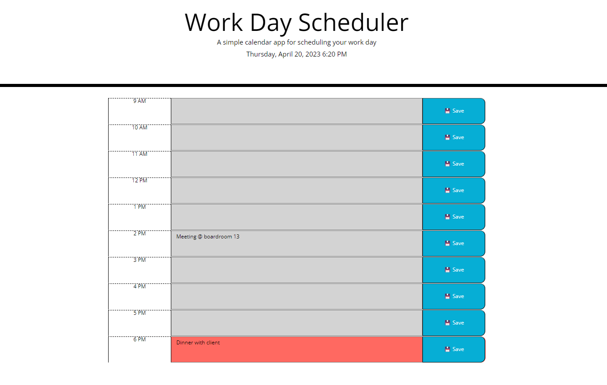

# workday-scheduler
Create a simple calendar application that allows a user to save events for each hour of the day by modifying starting code

## Table of Contents
>* Mock-Up
>* Usage
>* Credits
>* License

## Mock-up

>Link to site: [Workday Scheduler](https://matty-bamboo.github.io/workday-scheduler).

## Usage
N/A

## Credits

## License
workday scheduler is licensed under the MIT license